

    

# Fotay 📸
 
  

Fotay is a _**work in progress**_ photography / social network app that host photos from multiple users, adding the functionality for users to share their pictures and to interact with each other.

## Languages & libraries used in the making of this project:
* ***Java*** for the frontend and the logic.
* ***PHP*** for the backend and webservice communication.
* ***SQL*** for managing the data held in the database. 
&nbsp;
* [SQLite](https://developer.android.com/reference/android/database/sqlite/package-summary): a database that stores temporary files in the device storage.
* [Circle Image View Library](https://github.com/hdodenhof/CircleImageView): a circular ImageView for Android.
* [Picasso](https://github.com/square/picasso): a powerful image downloading and caching library for Android.
* [Volley](https://google.github.io/volley/):  an HTTP library that makes networking for Android apps easier and faster. 
* [ImagePicker](https://github.com/Dhaval2404/ImagePicker): picks an image from the gallery or captures it with the camera. 
* [Socialview](https://github.com/hendraanggrian/socialview): Android TextView and EditText with hashtag, mention, and hyperlink support.
* [TouchImageView](https://github.com/MikeOrtiz/TouchImageView): adds touch functionality to Android ImageView.
* [Pexels](https://www.pexels.com): a provider of stock photography and stock footage. 

## Screenshots

    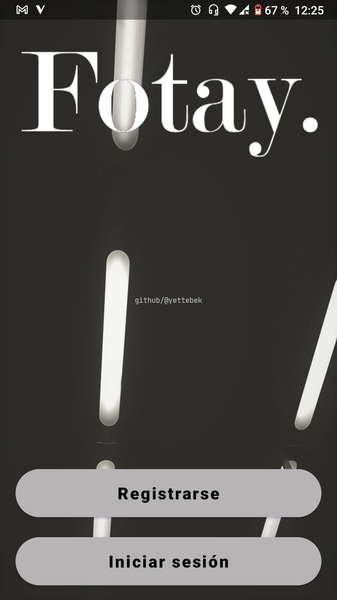&nbsp;&nbsp;&nbsp;
    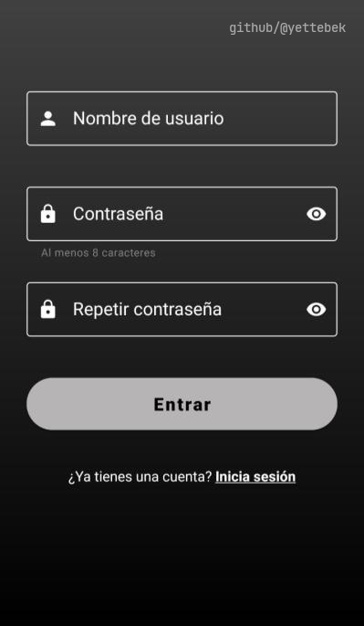&nbsp;&nbsp;&nbsp;

 

    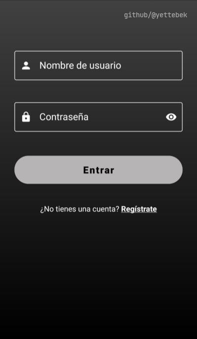&nbsp;&nbsp;&nbsp;
    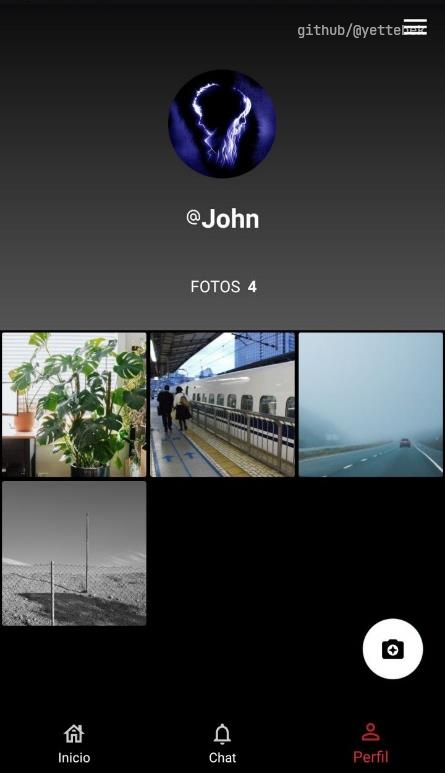&nbsp;&nbsp;&nbsp;  

 

    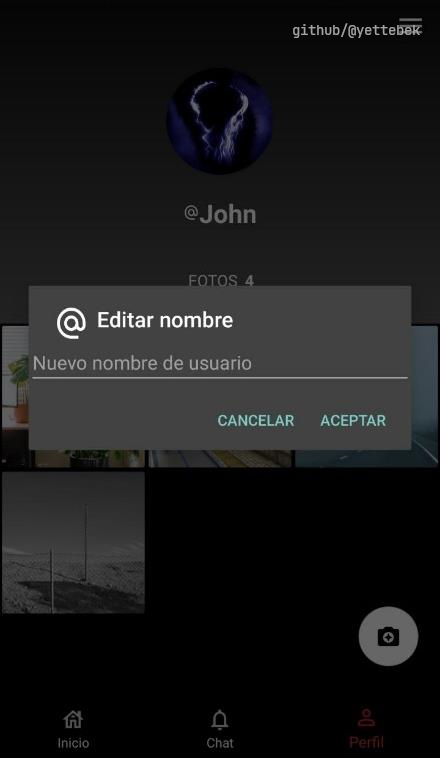&nbsp;&nbsp;&nbsp;
   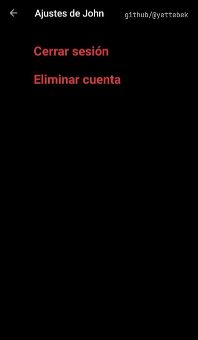&nbsp;&nbsp;&nbsp;

 

 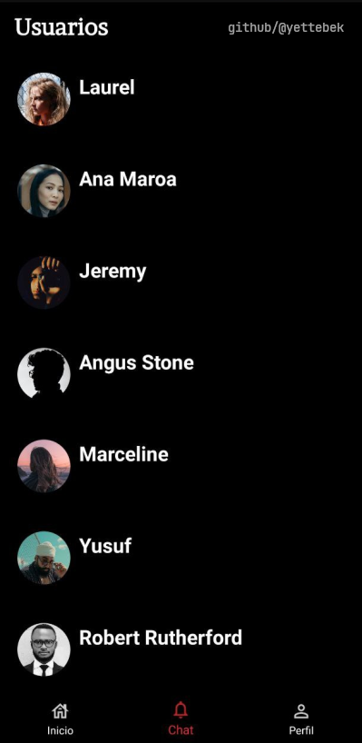&nbsp;&nbsp;&nbsp;&nbsp;
    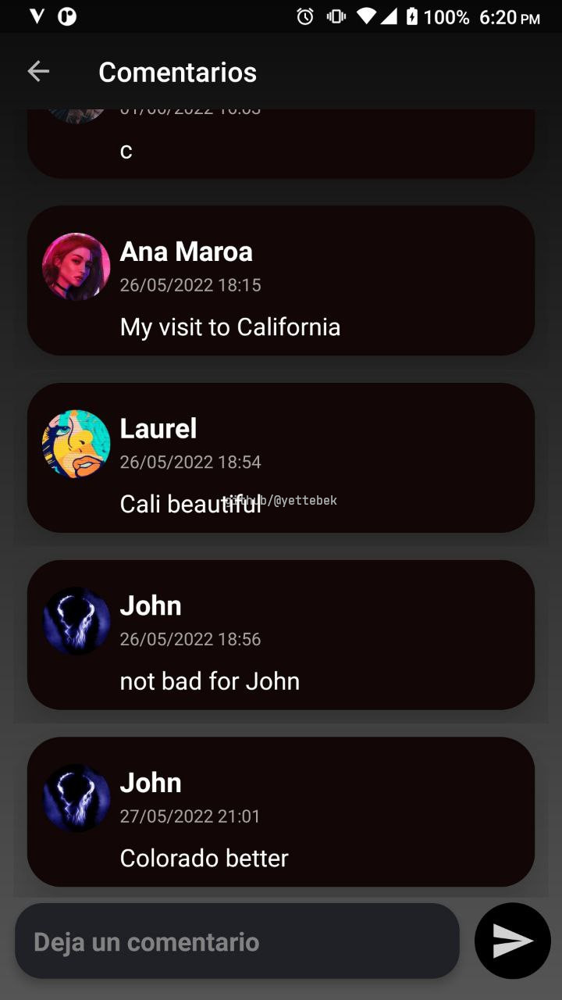&nbsp;&nbsp;
    

 

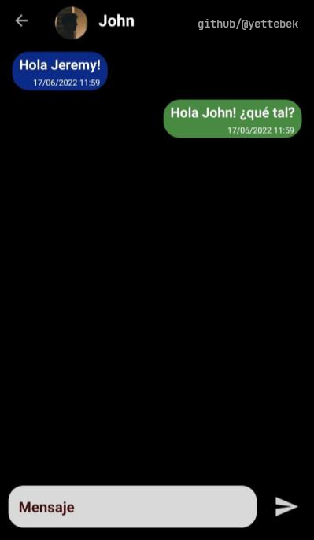&nbsp;&nbsp;&nbsp;
 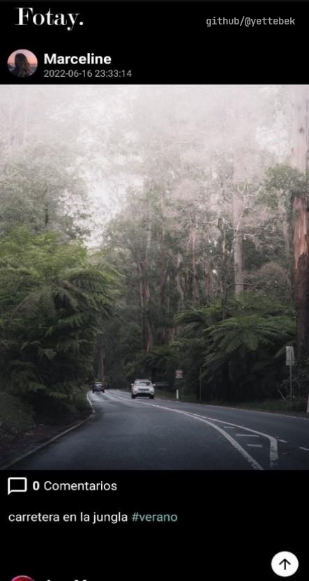&nbsp;&nbsp;&nbsp;

 

    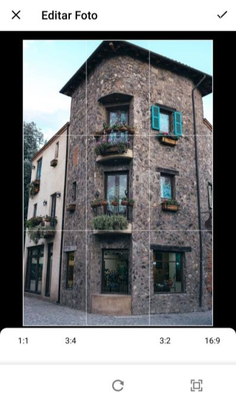&nbsp;&nbsp;&nbsp;
    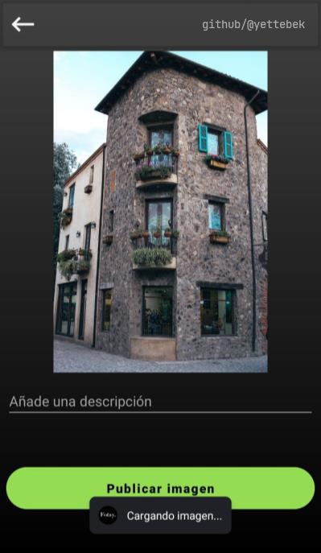&nbsp;&nbsp;&nbsp;

 

--- 

## Downloads

Click [here](https://github.com/yettebek/fotay-app/raw/main/releases/fotay_v0.1.0.apk) to download the app.
 
 

